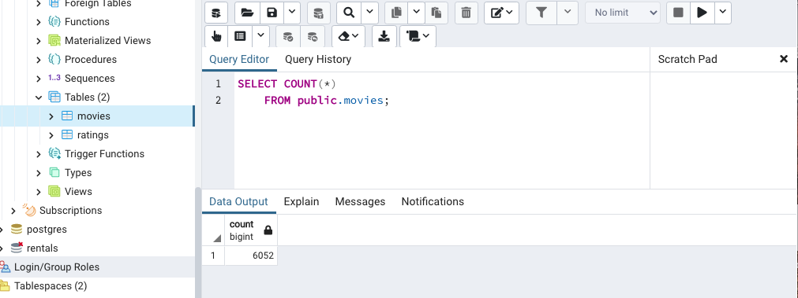

# Movies-ETL

The goal of this project was to clean movie data from wikipedia and kaggle, merge it, and then load it onto a SQL database. The movie information will be used for a hackaton, where participants create an algorithm to predict which low budget movies will be popular. In this project I used python, pandas, and SQL. 

After cleaning and merging movie data, there was a total of 6,052 unique movies on the list.

